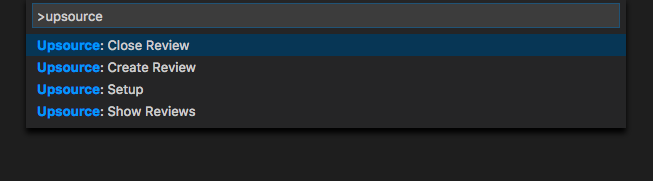
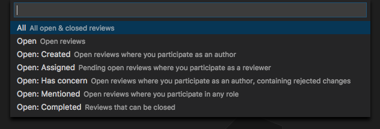

**This Project is not being maintained anymore.**

---

# vscode-upsource README

Provides basic interaction with your upsource reviews.
Also adds a custom explorer view that lists all open and closed reviews.



## Commands

`Upsource: Setup`  
Generates an upsource.json file for use with this extension. Please setup first before using further commands.

`Upsource: Show Reviews`  
Shows a list of all reviews with certain queries and opens them in your browser.



`Upsource: Create Review`  
Create a review based on a branch or your last commit.

`Upsource: Close Review`  
Close reviews that are ready to close.

`Upsource: Refresh`  
Fetches reviews and refreshes upsource custom view.

## Settings

`upsource.checkForOpenReviewsOnLaunch`  
Checks for open reviews on launch, if upsource.json is present

`upsource.customQueries`  
You're able to add custom queries to the extension. Every item in the array should have a label, description and query property. (For more information about queries, see the Upsource docs.)

Example:
```json
"upsource.customQueries": [
    {
        "label": "Raised concern",
        "description": "Reviews that have raised concern",
        "query": "#{has concern}"
    }
]
```

`upsource.defaultConfig`  
Add your default config values here for faster setup. Any values provided will be pre-filled
in the setup dialog. Password is left out for security reasons.


Example:
```json
"upsource.defaultConfig": [
    {
        "url": "http://yourdomain.com/upsource",
        "login": "your@email.com",
        "projectId": "your-project",
    }
]
```

`upsource.refreshInterval`  
Number of minutes between auto-refresh. Set to 0 for no refresh.

`upsource.resetParticipantsOnCreate`  
Resets all auto-assigned participants on creating a new review, leaving the author only.

## Known Issues

Please use the github issue tracker for any encountered problems.

**Enjoy!**
